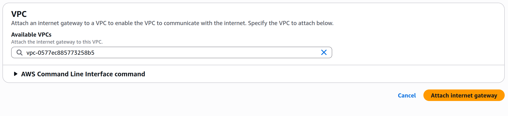

# scientific_network_tool
A script to automate setup a tool to safely access internet

# Summary
This document is to specify the steps that needs to be done to setup a v2ray server

# Networking Summary (for people interested in how it work)
1. v2ray techically do not distinguish b/w server and client, each machine is a v2ray node that connect together. But by the usecase, we separate them so it is easier to understand.

2. From the client config, you can see it start from the client sending out a vmess package encrypted by the id (a uuid you specified)

3. then the package is transported through the internet and reaches the aws zone, your vpc by your instance's ip address.

4. The aws global infrastructure already knows the account and vpc this public ip is used for, so it will send the package to the IGW of your vpc

PS. IGW is a VPC level component, it bridge the VPC and outer internet

5. when provide a public ip, the IGW will do the NAT (network address tranlation) it have a map to map public ip to private ip. therefore you get the private ip you should be connecting to

6. route table then take that ip and route it to the correct subnet

Example: if the destination is 10.0.0.15, the route table says:

10.0.0.0/24 → local → means “deliver inside this subnet.”

PS. route table is a subnet level routing mechanism, it need to be associated to a subnet, a new route table is auto done when creating a new subnet

7. when the traffic enter subnet, it need to go through NACL firewall rule

8.  inside the subnet, aws knows which ENI(elastic network interface) owns the ip, it need to go pass the SG (security group) firewall to enter ec2 instance

PS. ENI is a ec2 instance level component it is like a network card

*** Here conclude the inbound traffic to server, here is a flow chart

CLient->Internet->aws global infrastracture->IGW->VPC->routing table->subnet->NACL->ENI->SG->EC2 instace

VPC level:
    IGW

Subnet level:
    route table
    NACL

EC2 level:
    ENI
    SG

9. then the server will call the downstream api to get the data package and ready to response to client

10. how the server send back the data I do not understand, can check documentation on: https://www.v2fly.org/developer/protocols/vmess.html

11. it will pass SG as it is stateful so it auto grant permission for return traffic.

12. the it pass NACL's validation to exit subnet(stateless need to check everytime), reaches subnet routing table, when it is given a public ip address, it will route it to internet gateway

13. internet gateway will send back the package to internet and then reaches client

14. in case of using browser, after setting proxy, the browser will package the data into a sock and sent to client machine 127.0.0.1/localhost's 1080 port

*** Here conclude the outbound traffic to server, here is a flow chart

server->SG->NACL->subnet->route table->IGW->Internet->browser->client

# VPC setup
Fisrtly of all, we need to setup a VPC and VM to provision the hardwere to run our server. I use aws's free tier ec2 here (6month free with 100 USD credit). 

Step:
1. create a VPC in the region you lik*** Here conclude the imbound traffic to server, here is a flow charte, use the default CIDR range (CIDR range XXX,XXX,XXX,XXX/N just means the ip range if I keep the front N digit static and change the rest)

2. create the subnet on one of the AZ

3. create NACL (subnet level firewall rule and stateless) to allow all inbound and all outbound

4. create a internet gateway as bridge to connect vpc to public internet, and attach to vpc

5. add routing table rule for internet gateway so when we are sending reponse it will route it to internet gateway

6. create ec2 instance in the subnet
    Supported OS Platforms

    The following platforms are supported by V2Ray:

        Windows 7 and later（x86 / amd64 / arm32）
        macOS 10.10 Yosemite and later（amd64）
        Linux 2.6.23 and later（x86 / amd64 / arm / arm64 / mips64 / mips / ppc64 / s390x / riscv64）
            including but not limited to Debian 7 / 8, Ubuntu 12.04 / 14.04 and later, CentOS 6 / 7 and Arch Linux
        FreeBSD (x86 / amd64)
        OpenBSD (x86 / amd64)
        Dragonfly BSD (amd64)

    I use debian here
    

    you can set key for ssh traffic
    

    set public ip as true, so our client can connect to it
    

    set SG, make sure to enable ssh port 22 and vmess port you want to use
    

7. configure the security group, SG is on instance level (actually in the graphic card of the instance)
    set SG, make sure to enable ssh port 22 and vmess port you want to use
    

8. connect to instance,prepare ec2 instance as a v2ray server, ie. install v2ray software, config v2ray and start v2ray--->[Server setup]
    ssh into the ec2 instance use the server key

# Server setup

0. I have setup a bash script to automate this step, the detail steps you can see from 1+. (if you just want it to work, you can skip the rest detail step explanation)

    sudo su

1. ssh to the server

ssh -i <pem file path> admin@<ec2 ip address> #admin is debian's default user name

2. grant super user right so we won' be blocked
    sudo su

3. update apt local repocitory, and install useful cmd-line tool
    apt update
    apt install neovim

4. sync system time, as v2ray will check the socket from client and server to be < 90s difference

5. run the v2ray installtion script

6. enable v2ray to run automatically

7. stop v2ray and config v2ray (download existing server and client config file ), and all the helper command that might be useful

8. start v2ray and enjoy the internet XD

# Client setup

# Reference

https://www.v2fly.org/developer/protocols/vmess.html
https://guide.v2fly.org/basics/vmess.html#%E6%9C%8D%E5%8A%A1%E5%99%A8
https://www.v2fly.org/en_US/guide/install.html

